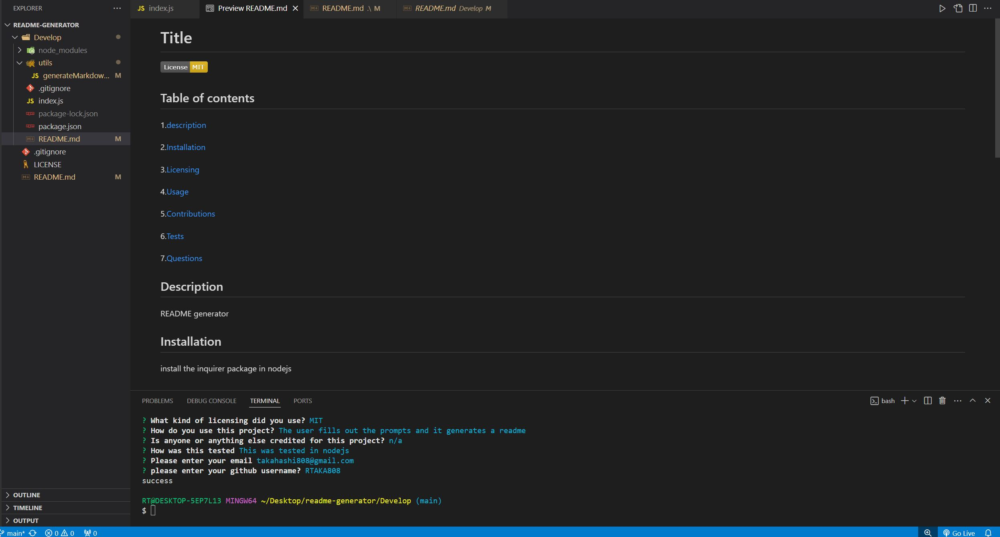

# readme-generator

## Description
This README.md generator was built to generate a README with only command line and nodejs.

## Installation
Install nodejs to start, then youll have to install the npm package 'inquirer'.

## Technologies
Javascript
npm inquirer
nodejs

## Usage
In your folder, right click on the index.js file and select "open in integrated terminal".  Once the terminal is open type in node index.js into the terminal and press enter to run.  Follow the prompts to add content to the README file that is being generated. Once all of the prompts are answered, if done correctly, a success message will show up in the terminal. 

## License
please see repository for licensing information

## Links
demo of the app:
https://watch.screencastify.com/v/CijgyzWB6mo3qXuqibJD

github repo:
https://github.com/RTAKA808/readme-generator

screenshot:
